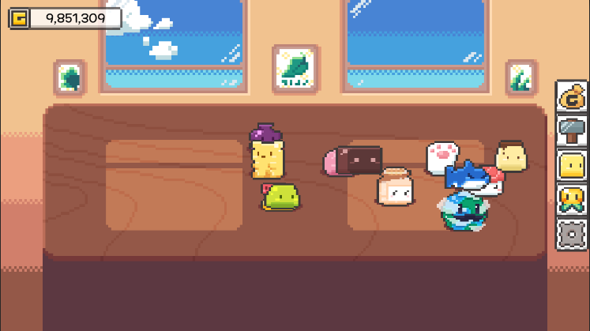

# Idle / Clicker Game
> 슬라임을 방치하거나 클릭하여 돈을 얻고 더 상위 슬라임을 해금하고 그 슬라임을 강화하세요

## 특징
- **슬라임 상태에 비례하는 골드 수급** : 가지고 있는 슬라임에 맞춰 클릭 / 방치 골드가 변화
- **상위 슬라임 해금 / 강화** : 골드를 이용하여 더 좋은 슬라임을 구입하고, 구입한 슬라임들을 이용하여 강화해 더 많은 골드를 수급
- **스킬** : 스킬을 구매하여 슬롯, 골드 추가 수급, 강화 확률 증가등의 효과를 구매
- **업적** : 플레이한 상태에 따라 업적 갱신

## Control
- LCick : 상호작용

### 개발 환경
- Unity 2021.3.18f1

#### 사용 Assets 
- 출처 : [볼트 2D 젤리팜 에셋 팩](https://assetstore.unity.com/packages/2d/characters/bolt-2d-jellyfarm-assets-pack-188722)

